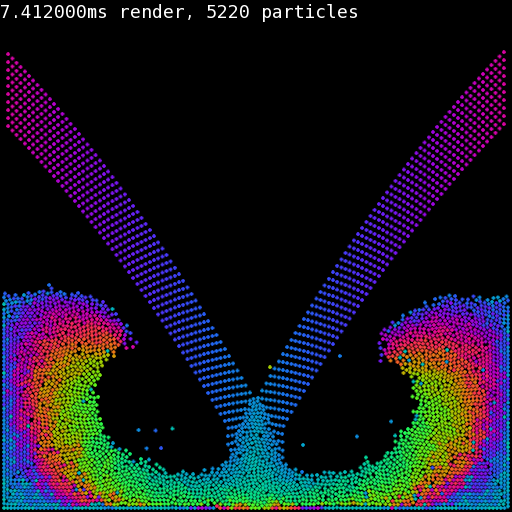

<p align="center"></p>

## What ?

A CPU multi-threaded particle simulator leveraging Verlet integration for particle position computation, SFML for graphics rendering and CMake for build configuration.

## Why ?

I wanted to warm-up for next period's course of High Performance Computing, which entails C++ and parallelism concepts.

## Credits 

This is my attempt at **replicating** Pezzza's project, ensuring I thoroughly understand the employed concepts. His video, which sparked my curiosity: https://www.youtube.com/watch?v=9IULfQH7E90

## Components Overview

- [`main.cpp`](src/main.cpp): Application entry point, handles configuration and main loop.
- [`Simulator`](src/simulator.cpp): Physics simulation of particles.
- [`Renderer`](src/renderer.hpp): Entity rendering with SFML.
- [`ThreadPool`](src/thread_pool.hpp): Thread pool implementation.
- [`InputHandler`](src/input_handler.hpp): User input responses.
- [`Particle`](src/physics/particle.hpp): State and behavior of particles.

# Getting Started

## Prerequisites
   
Have [CMake](https://cmake.org/) and [SFML](https://www.sfml-dev.org/) installed. 
On Arch Linux, you can install them with:

```sh
sudo pacman -S cmake sfml
```

1. **Clone the Repository**
   
```sh
git clone https://github.com/Hotz99/verlet_simulator.git
cd verlet_simulator
```

2. **Build the Project**

```sh
mkdir build
cd build
cmake ..
cmake --build .
```

4. **Run the Simulator**

```sh
./bin/VerletSimulator
```
